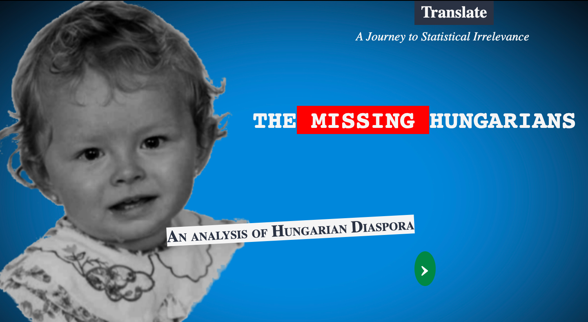

# Closing Comments on My Data Story

## My cover
My cover is based on the STOP SOROS posters I have posted about in the past. The entire color scheme of the project is based around the colors in the cover. I user the white, red, green, and blue throughout. I spent an entire day just doing the website building and cover page in both English and Hungarian. I like the cover, I wish my image was better. I tried my best to edit the photo I used without photoshop. In terms of selecting a theme and sticking to it... 10/10 is my score. Quality of the page? No one I have talked to likes the green button... so 7/10. It's pretty close to the poster I was basing it off of.

## Visualization 1 (kind of): Maps

This was just me giving context. I assumed that the viewer didn't know what Hungary was... or that Hungarians were considered an ethnic group. This page is a massive failure. I wanted to make GeoJSON files of all the historical maps, but it was really hard considering how weird the borders were, it was next to impossible to plot out what the former boarders would look like on a current map. At first, I had the images in as SVGs... but then I ended up making them PNG's so that they were easier to work with. I could never get the scroller example to work, so I used jQuery to get the fading effect. I would give this page a 3/10, I didn't user D3... I just wanted a context page. This page is nothing special.

## Visualization 2: Decline

I made a simple D3 line chart with a bar that shows the values of the 3 different Y-axis points over time. The colors are nice. I have some hidden citations in the text itself. There is nothing SUPER wrong with it. The black line you drag is bad because it's just about two millimeters off at the top when you hit the peak of the red and white lines. I couldn't fix it, I tried and I failed miserably. This visualization is successful in showing the correlated data. It looks nice if you don't look TOO close. I would rate this visualization a 5/10. I started out wanting to make three separate graphs, using sample code for a double Y axis chart I was able to modify the code to get this. I followed a tutorial on the black line label. All my citations are on the page.

## Visualization 3: Timeline

The graph works, you can click to see the same data grouped differently. This visualization was 100% inspired by a class example. At first I just wanted a simple timeline, but the clickable version is really cool. I would be happy with this if the tooltip was less buggy. Sometimes the opacity of the tooltip is wrong. It's just if you move the mouse too fast though. Overall it isn't a poor visualization. I would rate this graph a 7/10, because I actually learned a lot of CSS as a result of this chart, so I think I am partial to this one. All my citations are on the page.  

## Visualization 4: Workplace

I don't like this visualization mainly because it was horrible even getting the data to work with. I wanted to talk about economic opportunity diaspora and I thought looking at employment of Hungarians outside of Hungary was a good way, but really I don't think this was the best way to show it. I like showing this data better in a table, it is just WAY easier to look at, part of the issue is the scale. I didn't want to append numbers to the bars because I think it would be too muddy, and be distracting in the transition. I wanted to make a point on the range of professions, but I am not sure I was successful in that. I would rate the visualization a 4/10, I gave the bars the same shades of red as their respective flags... not that flag colors are well known for those two countries, I just thought it was a simple design touch that I could easily accomplish. All my citations are on the page.

## Visualization 5: Religion

I don't think this map was a good idea. I wanted to do something different, so I used the d3 gallery sample  "heat map" to create this. I colored the religions based on the "age" of the religion. The darker the red, the older the religion. Once again, a design touch I don't think people would care about. I ordered the religions based on popularity. It feels like the visualization is very busy. It is almost overwhelming to look at. Overall rating, 6/10, it just looks too busy, but I couldn't come up with a better way to show it. All my citations are on the page.

## Visualization 6: Outside Population Graph

I wanted this to be a bubble map so badly! But because Europe is so tightly packed, there was no way to make the population correlate to the size of the bubble without seriously enlarging Europe. I ended up coloring the dots based on high-estimate population so that there is at least some presence of the population. I am disappointed it isn't really a bubble map. I used green on this one because I noticed my other charts were very red heavy. Rating: 2/10, yes the data is shown, but the bubbles are just so off! I am very disappointed I couldn't make it work. All my citations are on the page.

## Visualization 7: Population Comparisons

This is an effort to compare populations of Hungarians living outside of Hungary, to those populations of people in county capitals in Hungary. THE BIGGEST CITIES... TECHNICALLY wouldn't be possible because there are three larger cities I didn't include due to overlap of counties. There wasn't a better GeoJSON of Hungary to show cities, so I just changed the dataset to compare county capitals instead of largest cities. Due to the change and the slight bugginess of the tooltip, this visualization gets a 4/10, it's not the data I originally wanted and the tooltip was incredibly difficult to work with.(Tooltips in general are the worst, I never want to make one again.)All my citations are on the page.

## Translations

The entire project is translated into Hungarian! All of the visualizations and text is too. It took a lot of time and it was really tedious, but I did the translations by hand because a) Google Translate for Hungarian is a joke and b) it would be terrible to make a project about Hungary without making it accessible to the population.

## Posting?

So, high key... I am very concerned about positing this, like up on a website. As I was doing the project, I noticed that the Hungarian Official Police Force's Instagram account kept getting recommended for me to follow despite none of my friends following the page. My instagram is not connected to my Facebook, which I know has previously been examined. I wasn't concerned until we watched our in-class film. If I were to actually have this project accessible it would probably be after winter break, so that I don't cause any unnecessary trouble during the holidays for my family.
